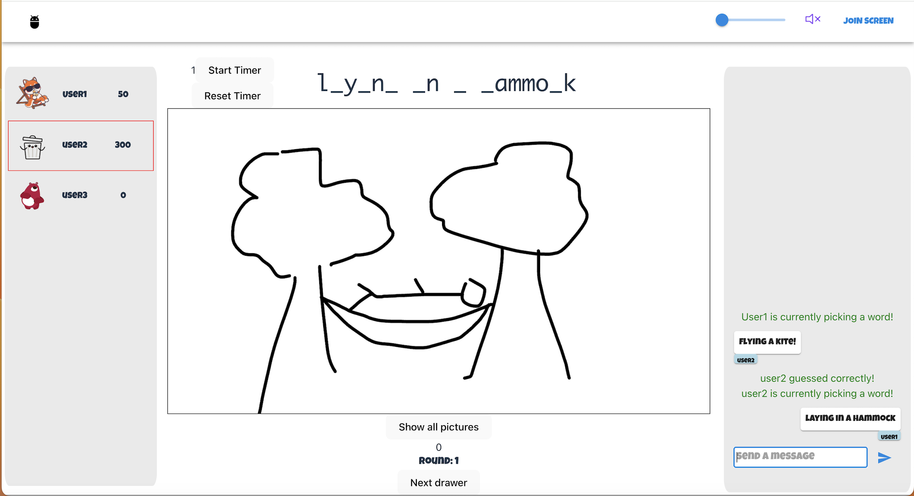

# DrawIt - Multiplayer Drawing Game

## Overview

DrawIt is a multiplayer drawing game inspired by Draw My Thing. It allows users to create lobbies, join friends, and have a blast drawing and guessing each other's creations. The game promotes creativity, social interaction, and lots of fun!



## Features

- **Multiplayer Drawing:** Collaborate with friends or challenge opponents in real-time drawing sessions.
- **Lobby System:** Create or join lobbies with a unique room name for seamless group play.
- **Ready Up:** Ensure everyone is prepared for the game before kicking off the drawing rounds.
- **Turn-Based Drawing:** Rotate drawing turns among players while the rest guess what's being drawn.
- **Scoring System:** Earn points for successful guesses and accurate drawings.
- **Leaderboard:** Track and celebrate the top artists and guessers.

## How to Play

Live game can be played at: https://draw-my-thing-0001e66dd219.herokuapp.com/

1. **Create a Lobby:** Start by creating a lobby or joining an existing one. Pick your username, avatar, and pick a room to create or join.
2. **Share Room Name:** Share the room name with friends so you can play together!
3. **Ready Up:** Wait for everyone to ready up before starting the game.
4. **Drawing Rounds:** Take turns drawing while others guess the word. Rotate turns for each player.
5. **Scoring:** Earn points for correct guesses and well-drawn images.
6. **Leaderboard:** Keep an eye on the leaderboard to see who's reigning supreme!

## Running project locally

To run the project locally, follow these steps:

1. **Clone the Repository:**
   ```bash
   git clone https://github.com/jay658/Draw-my-thing.git

2. **Install the Dependencies:**
   ```bash
   cd Draw-my-thing
   npm install

3. **Run the app locally**
   ```bash
   npm run start